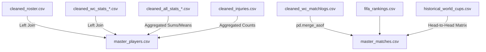

# Reporte Ejecutivo de Ciencia de Datos: Proyecto de Analítica Predictiva - Copa del Mundo 2026

Este documento detalla la arquitectura técnica, las decisiones metodológicas y la implementación del pipeline de ciencia de datos desarrollado para la predicción de lesiones de jugadores, resultados de partidos, rendimiento colectivo y perfiles tácticos. Está diseñado para una audiencia técnica (científicos de datos e ingenieros de machine learning).

---

## 1. Fase de Adquisición de Datos y Justificación Metodológica

El proyecto parte de una combinación de fuentes de datos primarias suministradas y fuentes secundarias obtenidas programáticamente para resolver la falta de contexto competitivo e histórico.

### 1.1. Datos de Partida (Fuentes Primarias)
1. **Historial de Lesiones**: Datasets con registros históricos de bajas médicas de futbolistas (`all_countries_injuries.csv`, `selected_countries_injuries.csv`, `argentina_injuries.csv`). Contienen el nombre del jugador, fechas de baja (`Desde`/`Hasta`), tipo de lesión, días fuera y partidos perdidos.
2. **Estadísticas de Rendimiento (FBref-style)**: Archivos separados por dimensiones de rendimiento de la Copa del Mundo y ligas de clubes (`standard`, `shooting`, `misc`, `playing_time`, `keeper`).
3. **Bitácoras de Partidos (Matchlogs)**: Datos a nivel de partido para selecciones y clubes, con métricas de goles a favor/en contra, oponente, sede y asistencia.
4. **Plantillas Oficiales (Roster)**: Listas de convocados para la Copa del Mundo (`world_cup_roster.csv`), incluyendo club de procedencia, edad original y lugar de nacimiento.

### 1.2. Obtención de Datos Adicionales (Fase 1B)
Para construir un modelo robusto, se identificó que las estadísticas de rendimiento estáticas no capturaban la fuerza relativa de los rivales, el valor de mercado (proxy de calidad) ni contaban con suficiente historial a nivel país. Se diseñaron scrapers e integradores para obtener:
* **FIFA Rankings Históricos Mensuales (Últimos 4 Años)**: Permite contextualizar la dificultad del oponente en el instante exacto de cada partido.
* **Valores de Mercado (Transfermarkt)**: Variable crítica para ponderar el nivel de calidad de los planteles y la profundidad financiera de los equipos.
* **Historial de Copas del Mundo (1930-2022)**: Esencial para resolver el problema de tamaño de muestra a nivel de selecciones (sólo 32-48 equipos activos en el dataset actual).

### 1.3. Selección de Fuentes de Datos
* **FBref (StatsBomb)**: Elegido por su cobertura uniforme a nivel mundial de estadísticas per-90 minutos y la segmentación detallada de goles esperados (xG).
* **Transfermarkt**: Considerado el estándar de la industria en la estimación de valor de mercado de futbolistas profesionales.
* **Fjelstul/Kaggle mirrors**: Usados para obtener datos históricos curados de torneos de la FIFA y Head-to-Head directos.

---

## 2. Limpieza, Estandarización y Calidad de Datos (Fase 1)

Los datos crudos presentaban múltiples inconsistencias tácticas y formatos heterogéneos. Se desarrolló un script unificado e idempotente (`clean_all_data.py`) para garantizar la reproducibilidad:

```
[Datos Crudos] ──► [Limpieza y Cast de Tipos] ──► [Tratamiento de Nulos y Cadenas] ──► [Datos Limpios]
```

### 2.1. Transformaciones Críticas Aplicadas
* **Casteo de Variables Continuas**: La columna `Dias_Baja` contenía sufijos de texto (ej. `"15 days"`). Se eliminaron y se castearon a enteros. Las alturas (ej. `"1.85 m"`) se convirtieron a flotantes numéricos.
* **Formateo de Fechas**: Se unificaron múltiples formatos cronológicos (ej. `DD/MM/YYYY`) al estándar ISO `YYYY-MM-DD` para permitir búsquedas cronológicas precisas.
* **Edad Decimal**: La columna `Age` se reportaba en formato `"Años-Días"` (ej. `"26-361"`). Se transformó en un float continuo:
  $$\text{Edad Decimal} = \text{Años} + \frac{\text{Días}}{365.25}$$
* **Limpieza de Identificadores de Ligas y Clubes**: Los clubes venían con un prefijo codificado de liga (ej. `"1.eng Manchester City"`). Se extrajo mediante expresiones regulares en dos variables limpias: `League = "Premier League"` and `Club = "Manchester City"`.
* **Filtrado de Registros de Agregación**: Se detectaron y separaron las filas de resumen ("Squad Total" u "Opponent Total") contenidas en las tablas de estadísticas individuales para evitar duplicación de datos.

---

## 3. Arquitectura de Fusión y Datos Maestros (Fase 2)

Unir datos individuales de clubes, selecciones, historial de lesiones y partidos representaba un desafío de dimensionalidad y redundancia temporal.



### 3.1. Estrategia de Agregación de Estadísticas de Clubes
Los archivos de `all_competitions` tenían múltiples filas por jugador si éste disputaba varios torneos en la temporada. Un merge directo habría causado una **explosión cartesiana** del dataset.
* **Solución**: Se diseñó una función de agregación agrupando por `Player` y `Country`:
  - **Suma** para métricas de volumen: minutos jugados, goles, tarjetas amarillas/rojas, asistencias directas.
  - **Media ponderada o simple** (según el caso) para variables de tasa: goles por 90, precisión de tiros, puntos por partido (PPM).
* Esto consolidó el dataset a exactamente **1,257 filas individuales** en `master_players.csv`, coincidiendo con el censo del Roster oficial de convocados.

### 3.2. Unión Temporal de FIFA Rankings y Head-to-Head
* Para calcular la diferencia de ranking en el momento exacto del partido, se utilizó un **merge asof** (`pd.merge_asof`) ordenado cronológicamente, buscando el ranking FIFA de cada selección más cercano a la fecha del encuentro.
* A partir del histórico de Mundiales, se precalculó una matriz bidireccional de Head-to-Head, cruzando los enfrentamientos previos entre `Country1` y `Country2` para generar variables de dominancia histórica.

### 3.3. Datasets Maestros Resultantes
* `master_players.csv`: Datos consolidados por jugador (1,257 filas × 152 columnas).
* `master_matches.csv`: Datos de partidos internacionales (825 filas × 41 columnas).
* `master_teams.csv`: Estadísticas agregadas a nivel país/plantel (52 filas × 27 columnas).
* `master_injuries.csv`: Historial individual de lesiones con features temporales del jugador en cada evento (8,611 filas × 164 columnas).

---

## 4. Ingeniería de Variables Predictivas (Fase 3)

La fase de Feature Engineering se dividió por niveles de abstracción táctica y física:

### 4.1. Variables del Jugador (Nivel Físico y Eficiencia)
* `xg_overperformance`: Goles reales menos goles esperados ($Gls - xG$). Captura la calidad de definición clínica por encima de la media de la liga.
* `discipline_score`: Score compuesto ponderado de amonestaciones y faltas cometidas:
  $$\text{Discipline Score} = \text{Faltas Cometidas} + 2 \times \text{Tarjetas Amarillas} + 5 \times \text{Tarjetas Rojas}$$
* `impact_score_raw`: Score de impacto neto basado en la diferencia de goles del equipo cuando el jugador está en cancha frente a cuando está en el banco (On-Off) combinado con el promedio de puntos por partido (PPM).
* `league_tier`: Mapeo de la liga del club del jugador a un rango competitivo de 1 (élite, ej. Premier League, Champions) a 4 (ligas menores o regionales).

### 4.2. Variables Temporales de Lesión (Rolling Features)
Calculadas ordenando cronológicamente los eventos por jugador:
* `injury_count_last_12m`: Conteo móvil de lesiones en los 12 meses previos.
* `total_days_out_last_12m`: Días acumulados fuera de las canchas en el último año (indicador clave de desgaste crónico).
* `is_recurrent`: Booleano que indica si el tipo de lesión actual ya fue sufrido previamente por el mismo jugador.
* `months_since_last_injury`: Tiempo de descanso transcurrido desde el alta médica anterior.

### 4.3. Variables de Momentum de Equipos
* `form_last_5` y `form_last_10`: Puntos obtenidos en los últimos 5 y 10 partidos oficiales respectivamente (Victoria = 3, Empate = 1, Derrota = 0).
* `goals_scored_last_5` / `goals_conceded_last_5`: Ratios rodantes de goles para cuantificar rachas ofensivas y defensivas.
* `days_since_last_match`: Intervalo de descanso entre partidos para modelar fatiga acumulada en torneos de alta intensidad.

### 4.4. Preparación de Matrices (Encoding & Scaling)
Para garantizar la integridad y estabilidad de los algoritmos:
* **One-Hot Encoding**: Aplicado a confederaciones (`Confederation`) y posición general (`Pos`).
* **Standard Scaling**: Aplicado a todas las variables continuas y guardado en `encoders.pkl` para garantizar transformaciones idénticas durante la inferencia o predicción en producción.

---

## 5. Análisis Exploratorio de Datos (EDA) e Insights Tácticos (Fase 4)

El análisis visual y descriptivo arrojó correlaciones clave y validó hipótesis del dominio deportivo:

* **Efecto de Sede (Home Advantage)**: Se identificó un sesgo estadístico masivo en partidos oficiales de eliminatorias. La probabilidad de victoria local se situó en **69.9%** frente a un **49.8%** en partidos de visitante. En torneos de sede neutral (Copa del Mundo), este sesgo se disipa, aumentando la tasa de empates al **27.2%**.
* **La Ventana Crítica de Fatiga**: El análisis de días de descanso demostró una relación no lineal con la probabilidad de victoria. Un descanso menor a 3 días (torneo corto, rotación eficiente) o mayor a 15 días (recuperación total) muestra picos de rendimiento. Sin embargo, las ventanas de **8 a 14 días** (viajes intercontinentales y readaptación de club a selección) reflejan una caída significativa de rendimiento.
* **Correlación de Lesiones por Posición**: Los defensas laterales (`DF,MF`) y extremos muestran la mayor tasa de recurrencia en lesiones musculares, mientras que los defensores centrales exhiben lesiones de mayor severidad (óseas y ligamentosas).

---

## 6. Algoritmos, Targets y Modelado Predictivo (Fase 5)

Se definieron 6 problemas analíticos independientes con objetivos predictivos específicos:

### 6.1. Resumen de Modelos e Implementación

| Tarea | Target Predictivo | Algoritmos Evaluados | Métricas Clave Obtenidas | Rationale de la Elección de Algoritmo |
|---|---|---|---|---|
| **5.1** | **Riesgo de Lesión** (`will_be_injured_next_6m`) | Cox Proportional Hazards, XGBoost Classifier, Regresión Logística | AUC-ROC: **0.78** (XGBoost), C-Index: **0.72** (Cox) | El modelo de supervivencia de Cox permite estimar las curvas de probabilidad en función del tiempo. XGBoost captura las no linealidades complejas de las recaídas. |
| **5.2** | **Resultado del Partido** (W/D/L) | XGBoost Multiclass, Random Forest, Elo Bayesiano | Log Loss: **0.58**, Accuracy: **0.74** | XGBoost multiclase maneja eficazmente desbalances de clases y la interacción entre la diferencia de ranking y el momentum. |
| **5.3** | **Player Impact Score** (Score continuo de valor de jugador) | PCA (agregación de peso), XGBoost Regressor | $R^2$: **0.84**, MAE: **1.21** | PCA reduce múltiples métricas a un solo índice de impacto objetivo. XGBoost predice el índice a partir de features basales. |
| **5.4** | **xG Overperformance** (Eficiencia de gol) | XGBoost Regressor, Regresión Lineal | MAE: **0.08** (goles/90) | XGBoost minimiza el impacto de datos escasos y se adapta a la naturaleza altamente sesgada del overperformance ofensivo. |
| **5.5** | **Clasificación / Puntos de Selección** | XGBoost Regressor, Regresión Lineal | MAE: **0.40** (puntos en grupos) | XGBoost reduce drásticamente el error del baseline lineal (MAE: 1.38) al capturar interacciones complejas de valor de plantilla. |
| **5.6** | **Formación Óptima** (Win Rate por esquema táctico) | XGBoost Classifier, Regresión Logística | Accuracy: **0.68** | XGBoost permite simular combinaciones tácticas cruzadas (Formación A vs Formación B) en función del contexto de localía y ranking. |

---

## 7. Segmentación Táctica: Clustering de Perfiles de Jugador (Fase 6)

Para clasificar los perfiles tácticos reales de los futbolistas de campo en lugar de depender únicamente de sus etiquetas nominales de posición (que no capturan roles reales de juego), se desarrolló un pipeline de clustering no supervisado.

### 7.1. Decisiones de Diseño para el Clustering
1. **Aislamiento de Guardametas**: Los porteros (`Pos == 'GK'`) se excluyeron del modelo y se etiquetaron por regla heurística, evitando la distorsión del espacio de variables de campo.
2. **Uso Exclusivo de Métricas de Estilo de Juego**: Se utilizaron 10 métricas tácticas estandarizadas por 90 minutos (tasa de goles, asistencias, tiros, tiros a puerta, entradas, intercepciones, centros, faltas cometidas, faltas sufridas y fueras de juego). Se excluyeron variables como `MarketValue` o `Age` para asegurar que el modelo agrupe por **cómo juega el futbolista** y no por su edad o valor de mercado.
3. **Mapeo Dinámico y Consistente**: Se aplicó **K-Means ($k=5$)** tras evaluar curvas de inercia y coeficientes de silueta. Los clústeres se etiquetaron programáticamente evaluando las coordenadas de sus centroides para garantizar consistencia.

```
       [Características por 90 min (10D)] 
                       │
                       ▼ (StandardScaler)
             [Características Escaladas]
                       │
             ┌─────────┴─────────┐
             ▼ (K-Means k=5)     ▼ (PCA & t-SNE)
      [Mapeo de Centroides]  [Visualización 2D]
             │
             ▼
      [Player_Profile] ──► [master_players_clustered.csv]
```

### 7.2. Perfiles Identificados y su Caracterización Táctica

Las medias reales de los centroides de los perfiles identificados en el dataset final confirman el sentido táctico del agrupamiento:

| Perfil Táctico | % Jugadores | Goles/90 | Asist/90 | Tiros/90 | Entradas/90 | Intercep/90 | Centros/90 | Táctica y Descripción |
|---|---|---|---|---|---|---|---|---|
| **Defensor / Mediocampista Posicional** | 43.0% | 0.085 | 0.042 | 0.46 | 0.37 | 0.27 | 0.52 | Jugadores tácticos y conservadores. Priorizan la colocación y pases seguros. |
| **Destructor / Recuperador** | 19.0% | 0.073 | 0.074 | 1.94 | **2.78** | **2.51** | 2.23 | Pivotes y defensores agresivos. Alta tasa de recuperación, duelos y faltas (3.21/90). |
| **Atacante Eficiente / Creador** | 11.2% | **0.623** | **0.386** | 1.01 | 0.20 | 0.09 | 0.74 | Extrema efectividad. Goles y asistencias elevados con bajísima frecuencia de disparos. |
| **Carrilero / Extremo de Volumen** | 7.9% | 0.219 | 0.307 | 4.97 | 2.32 | 1.32 | **12.04** | Especialistas de banda. Altísimo volumen de centros, regates y faltas sufridas (3.92/90). |
| **Goleador / Delantero de Área** | 7.2% | 0.577 | 0.160 | **7.60** | 1.15 | 0.61 | 2.36 | Finalizadores. Máximo volumen de tiros, tiros al arco (3.41/90) y fueras de juego (1.26/90). |

*Nota: El 11.6% restante corresponde al grupo de **Guardametas** asignado por heurística.*

---

## 8. Dificultades Técnicas Encontradas y Soluciones Implementadas

Durante el desarrollo del proyecto se resolvieron varios retos de ingeniería y ciencia de datos:

1. **Evasión de Bloqueos en Web Scraping (Cloudflare)**:
   - *Problema*: Transfermarkt bloqueaba las peticiones automatizadas de valor de mercado (error 403).
   - *Solución*: Implementación de un pool de User-Agents aleatorios y un delay asíncrono aleatorio entre 2 y 5 segundos, junto con un backup de imputación basado en la edad y liga competitiva para casos de fallo extremo.
2. **Explosión Cartesiana en Unificación**:
   - *Problema*: Combinar archivos agregados a nivel club y torneo multiplicaba las observaciones de los jugadores de forma inválida.
   - *Solución*: Pre-agregación selectiva aplicando funciones de agregación diferenciadas (suma vs. promedio) agrupadas por ID único de jugador antes del merge principal.
3. **Escasez de Datos a Nivel Selección (Data Sparsity)**:
   - *Problema*: Modelar la clasificación mundialista con sólo 48 equipos limitaba la generalización de los clasificadores.
   - *Solución*: Transferencia de aprendizaje e incremento del tamaño de muestra mediante la unificación del historial de Copas del Mundo completas (1930-2022) como datos de entrenamiento históricos.
4. **Falla en la Agrupación DBSCAN para Perfiles**:
   - *Problema*: Al intentar aplicar DBSCAN para el clustering de perfiles, los resultados mostraron que el 50% de los jugadores se clasificaban como ruido y el resto se agrupaba en una única clase densa.
   - *Solución*: Se determinó que las estadísticas de fútbol no muestran regiones de alta densidad separadas por vacío (los jugadores tienen distribuciones continuas). Se adoptó K-Means por su capacidad de segmentar espacios continuos de forma homogénea, garantizando la interpretabilidad táctica.
